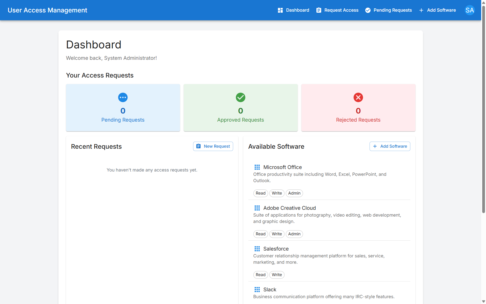

# User Access Management System



A comprehensive system for managing user registrations, software access requests, and managerial approvals. This application supports role-based authentication with JWT, access request submission and approval workflows, and software management.

Live Demo: [https://user-access-management-system.vercel.app/](https://user-access-management-system.vercel.app/)  
GitHub Repository: [https://github.com/Hmtgit7/user-access-management-system](https://github.com/Hmtgit7/user-access-management-system)

## Features

- **User Registration & Authentication**: Secure signup and login with JWT tokens
- **Role-Based Access Control**: Three roles with different permissions
  - **Employee**: Can request software access
  - **Manager**: Can approve/reject access requests
  - **Admin**: Can create and manage software entries
- **Software Management**: Add, edit, and remove software entries
- **Access Request Workflow**: Request submission, approval, and rejection
- **Responsive UI**: Modern interface built with React, Material UI, and Tailwind CSS

## Tech Stack

### Backend

- Node.js with Express
- TypeScript
- PostgreSQL database
- TypeORM for database interaction
- JWT authentication
- RESTful API architecture

### Frontend

- React with TypeScript
- Material UI components
- Tailwind CSS for styling
- Formik and Yup for form validation
- Axios for API communication
- Context API for state management

## Project Structure

```
user-access-management-system/
├── backend/              # Node.js Express server
├── frontend/             # React frontend application
├── docker-compose.yml    # Docker Compose configuration
└── README.md             # This file
```

## Getting Started

### Prerequisites

- Node.js (v14+)
- PostgreSQL
- Docker (optional)

### Setup Options

#### Option 1: Local Development

1. Clone the repository:

```bash
git clone https://github.com/Hmtgit7/user-access-management-system.git
cd user-access-management-system
```

2. Set up backend and frontend:

```bash
# Install backend dependencies
cd backend
npm install
npm run dev

# In a new terminal, install frontend dependencies
cd frontend
npm install
npm start
```

3. Access the application at http://localhost:3000

#### Option 2: Docker

1. Clone the repository:

```bash
git clone https://github.com/Hmtgit7/user-access-management-system.git
cd user-access-management-system
```

2. Run with Docker Compose:

```bash
docker-compose up
```

3. Access the application at http://localhost:3000

## Default Admin Account

After setting up, you can log in with these credentials:

- Username: admin
- Password: admin123

## Testing Different User Roles

Pre-configured test accounts:

- Employee: `employee/password123`
- Manager: `manager/password123`
- Admin: `admin/admin123`

## Documentation

- [Backend Documentation](./backend/README.md)
- [Frontend Documentation](./frontend/README.md)

## License

This project is licensed under the MIT License - see the LICENSE file for details.

## Acknowledgments

- [TypeORM](https://typeorm.io/)
- [Material UI](https://mui.com/)
- [Tailwind CSS](https://tailwindcss.com/)
